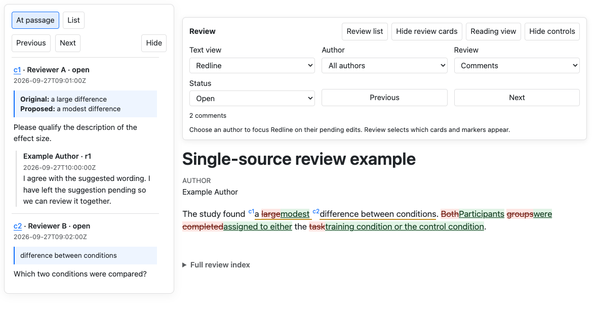

# Quarto review

**Write and revise your manuscript in Quarto while collaborators review Word drafts with native comments and tracked changes.**
Quarto review brings supported Word feedback into editable QMD, keeps discussions attached to the text, and exports Word drafts with native review information.
Work in your preferred editor or with a coding assistant, inspect an HTML preview, and render Word when you are ready to share.

[Try the live guide](https://githubpsyche.github.io/quarto-review/) · [Download the editable example](https://githubpsyche.github.io/quarto-review/downloads/walkthrough.zip)

The preview above comes from the [included small example](examples/single-source-proposal/index.qmd).
Its suggested replacement is stored directly in QMD:

~~~markdown
{~~large~>modest~~}{#s1 by=RA at=2026-09-27T09:00:00Z}
~~~

Comments and replies live in the same file, with their authors and decisions.
Ordinary prose edits need no markup: they are compared with a frozen reference.
The HTML preview is read-only; make edits, replies and decisions in the source or with the review commands.

## Try a complete example

Install Python 3.12 or later, Git and [Quarto](https://quarto.org/docs/get-started/), tested with version 1.8.27.
From a directory where you want to keep the package and example, run the following in a macOS or Linux shell:

~~~sh
git clone --branch v0.3.2 https://github.com/githubpsyche/quarto-review.git
cd quarto-review
python3 -m venv .venv-user
source .venv-user/bin/activate
python -m pip install .
cp -R examples/single-source-proposal ../quarto-review-example
cd ../quarto-review-example
quarto-review enable
quarto-review validate
quarto render index.qmd --to html
quarto render index.qmd --to docx
~~~

Open `_output/index.html` to inspect the review and `_output/index.docx` to share it in Word.
HTML starts with open comments; switch Review to Changes to inspect suggestions, or use Original, Proposed and Redline to compare wording.
Reading view hides review information and shows the proposed text.

On Windows, create the environment with `py -3 -m venv .venv-user`, activate it with `.venv-user\Scripts\Activate.ps1` in PowerShell, and copy the example with `Copy-Item -Recurse examples/single-source-proposal ../quarto-review-example`.
Keep the installed environment available while your projects use it.
See [installation and upgrades](docs/installation.md) for moving a project or choosing another verified version, and [release evidence](docs/release.md) for the tested scope of v0.3.2.

## Work through a comment

In that example, Reviewer A asks whether the effect should be described as large and proposes modest.
To agree with the wording, record your response and close the discussion, run:

~~~sh
quarto-review feedback --id c1
quarto-review accept s1
quarto-review reply c1 --body "I have accepted modest as the description of the effect."
quarto-review resolve c1
quarto-review validate
quarto render index.qmd --to html
quarto render index.qmd --to docx
~~~

Accepting the suggestion selects its wording; resolving the comment closes the discussion and retains the replies.
These are separate decisions: a resolved comment can still have wording changes awaiting review.
The [source and command guide](docs/single-source.md) explains how to add feedback, reject or reopen decisions, and remove settled suggestions from the source with `compact`.

## A Word review round

1. Edit QMD, inspect HTML and export Word. Retain the exact draft sent and its matching source, reference, configuration and assets.
2. Import the returned Word file into a separate candidate directory. Compare it with both the version sent and your current working source.
3. Apply the reviewed wording decisions and transfer replies and thread states with their original attribution and native records, retaining local edits made since export. This reconciliation is an explicit source-level step.
4. Validate, inspect HTML and export the next Word draft. Keep the reference frozen until you deliberately begin another review round.

The [short public walkthrough](https://githubpsyche.github.io/quarto-review/#review-round) shows an accepted wording change, a returned reply and a newer local edit.
The [worked review round](docs/review-round.md) gives the commands and record-transfer procedure.
Native application checks currently cover Word for Mac 16.113.3; Windows and Word for the web have not been checked.

## Use your own manuscript

In a separate manuscript directory containing a plain `index.qmd`, run:

~~~sh
quarto-review init --author "Your Name"
quarto render index.qmd --to html
quarto render index.qmd --to docx
~~~

Initialization adds review settings, enables the extension and freezes a reference.
The review author identifies new feedback and does not replace the manuscript's author field.
For an existing annotated source or an imported Word candidate, use `quarto-review enable` instead.
Your normal Quarto format settings, including installed APAQuarto formats, determine the manuscript layout.

| File | Purpose |
| --- | --- |
| `index.qmd` | Manuscript, suggestions, comments, replies and decisions |
| `reference.qmd` | Frozen annotated source for the current review round |
| `_quarto.yml` and ordinary assets | Formats, bibliography, figures and execution settings |

Keep citations as ordinary `[@key]` and `@key` source with reference data in your bibliography.
The [citation guide](docs/citations.md) covers recovery of supported references from Word and review of citation edits.
The current format is schema 2; the older QMD plus `review.yml` format remains supported, with [explicit candidate migration](docs/development-isolation.md#upgrades-and-migrations).

## Documentation and help

- [Source syntax, HTML controls and review commands](docs/single-source.md)
- [Installation, Word settings, upgrades and removal](docs/installation.md)
- [Word returns and reconciliation](docs/review-round.md)
- [Supported behaviour and limits](docs/status.md)
- [Release verification](docs/release.md), [architecture](docs/design.md) and [performance](docs/performance.md)
- [Building the public guide](docs/demo.md)

For questions or reproducible problems, [open an issue](https://github.com/githubpsyche/quarto-review/issues).
Use a small synthetic example when reporting a document problem.
See [CONTRIBUTING.md](CONTRIBUTING.md) for development guidance and [development isolation](docs/development-isolation.md) before testing changes around manuscript projects.

Maintained by [Jordan Gunn](https://github.com/githubpsyche). Licensed under [Apache-2.0](LICENSE).
